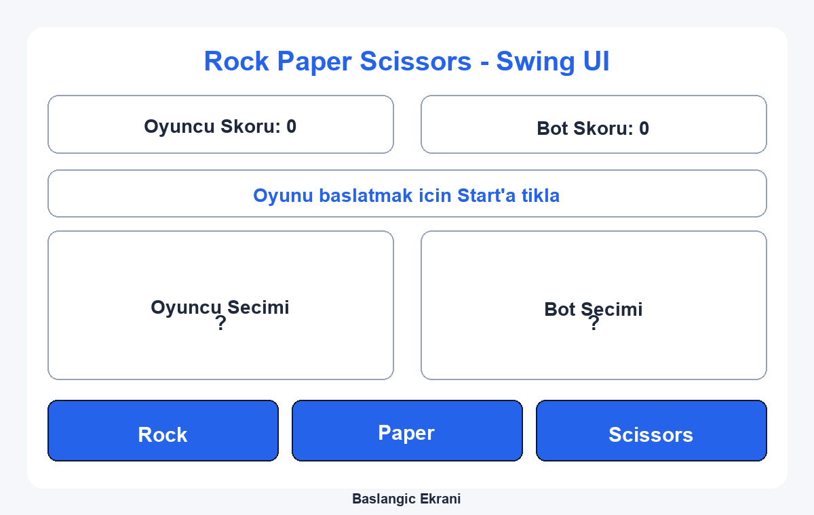
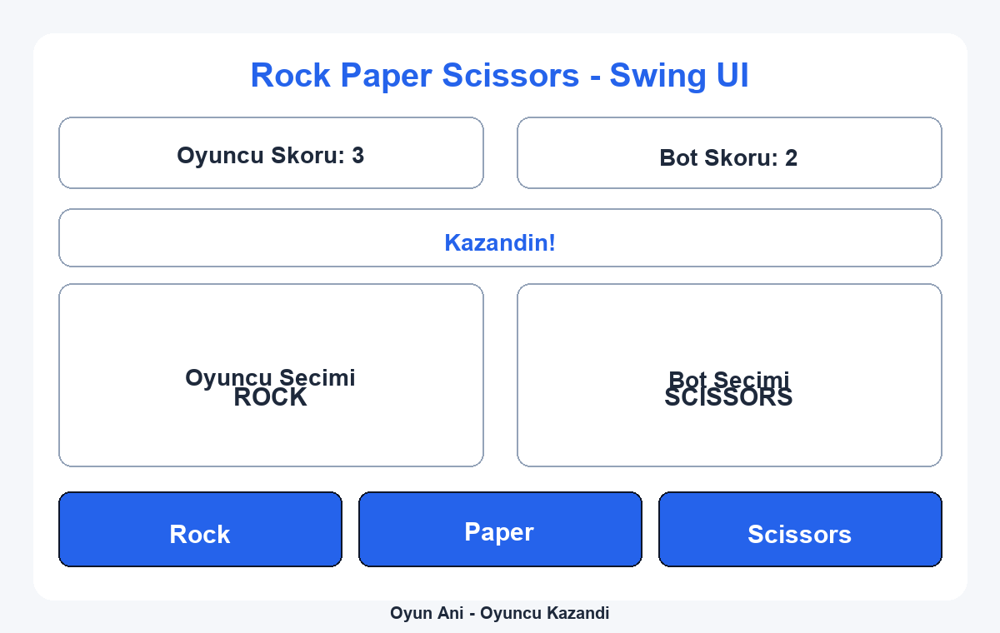
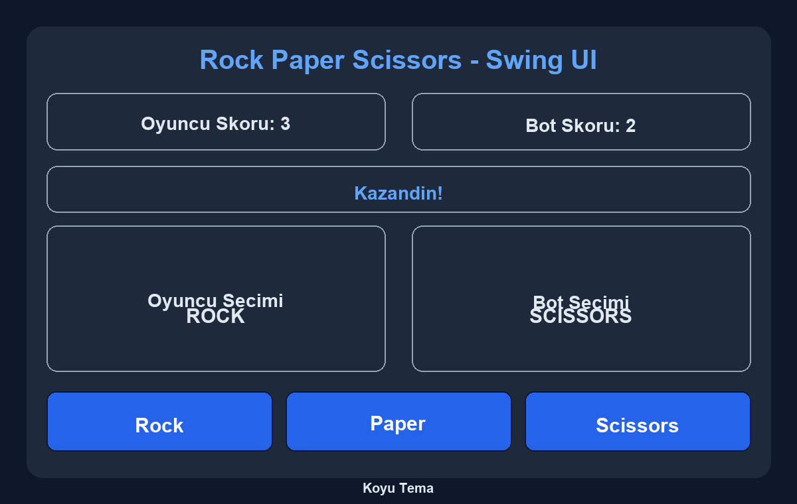

# Rock Paper Scissors - Swing UI

Bu proje, Java Swing ile gelistirilmis modern arayuze sahip bir tas-kagit-makas oyunudur.

## Ozellikler

- Moduler yapi: `Main`, `GameUI`, `Game`, `Save`
- Gelismis Swing yerlesimi (skor kartlari, tur sonucu, secim panelleri)
- Acik/koyu tema gecisi
- Oyun kaydetme ve yukleme (`save/savegame.txt`)
- Ikon tabanli secim butonlari ve gorsel fallback davranisi

## Ekran Goruntuleri





## Proje Yapisi

```text
src/
  rockpaperscissors/
    Main.java
    GameUI.java
    Game.java
    Save.java
    assets/
      rock.png
      paper.png
      scissors.png
      rock-paper-scissors.png
docs/
  images/
    home.png
    round-win.png
    dark-theme.png
save/
  savegame.txt
```

## Eclipse ile Calistirma

1. Projeyi Eclipse ile ac.
2. `src/rockpaperscissors/Main.java` dosyasini `Run As > Java Application` ile calistir.

## Komut Satiri ile Calistirma

Sisteminizde JDK kuruluysa:

```bash
mkdir -p bin
javac -d bin src/rockpaperscissors/*.java
java -cp bin rockpaperscissors.Main
```

## Varliklari Yeniden Uretme

Ikonlar ve README gorselleri Python/Pillow scripti ile otomatik uretilebilir:

```bash
python3 scripts/generate_assets.py
```
